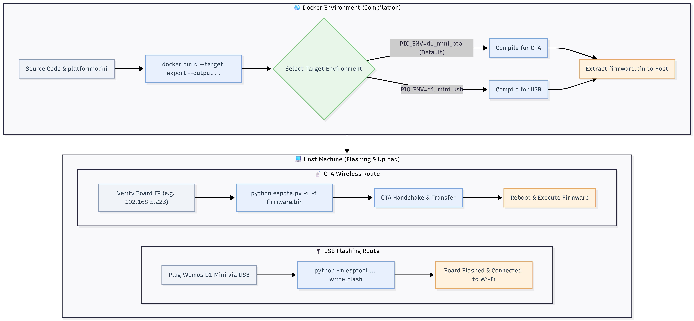

# Wemos D1 Mini Firmware Build & Flash Guide

A lightweight, reproducible setup using **Docker** for compilation and native **Python tools** on the host for USB and Over-The-Air (OTA) flashing.

---

## Table of Contents

- [Overview](#overview)
- [Prerequisites](#prerequisites)
- [Repository Structure](#repository-structure)
- [1. Compile Firmware via Docker](#1-compile-firmware-via-docker)
  - [Build for OTA (Default)](#build-for-ota-default)
  - [Build for USB Initial Setup](#build-for-usb-initial-setup)
- [2. Flash via USB (Initial Setup / Recovery)](#2-flash-via-usb-initial-setup--recovery)
- [3. Flash via OTA (Wireless Updates)](#3-flash-via-ota-wireless-updates)
  - [One-Time OTA Tool Setup](#one-time-ota-tool-setup)
  - [Push Firmware Wirelessly](#push-firmware-wirelessly)
- [Troubleshooting](#troubleshooting)

---

## Overview



This project decouples compilation from flashing:
* **Docker Multi-Stage Build:** Compiles the C++ source code in an isolated environment and exports only the final `firmware.bin` to your host machine.
* **Host Terminal Flashing:** Flashes `firmware.bin` directly using Python utilities (`esptool` or `espota.py`), avoiding Docker volume mapping and network sandbox issues.

---

## Prerequisites

Before starting, ensure your host machine has:

1. **Docker / Docker Desktop** installed and running.
2. **Python 3** installed on your host system.
3. Host dependencies installed via terminal:
   ```cmd
   python -m pip install esptool pyserial
   ```

---

## Repository Structure

```text
.
├── Dockerfile           # Multi-stage Docker builder
├── .dockerignore        # Ignores build artifacts and cache
├── platformio.ini       # PlatformIO configuration
├── espota.py            # Espressif OTA upload script
└── src/
    └── main.cpp         # Arduino C++ source code
```

---

## 1. Compile Firmware via Docker

Run `docker build` from your host terminal in the project directory. The exported `firmware.bin` file will be placed directly in your current directory.

### Build for OTA (Default)
```bash
docker build --target export --output . .
```

### Build for USB Initial Setup
```bash
docker build --build-arg PIO_ENV=d1_mini_usb --target export --output . .
```

---

## 2. Flash via USB (Initial Setup / Recovery)

Use this method for the first flash, or if the board loses network connectivity.

1. Connect your Wemos D1 Mini to your computer via USB.
2. Identify your serial port (e.g., `COM3` on Windows, or `/dev/ttyUSB0` on Linux).
3. Run `esptool` to write the firmware:

```cmd
python -m esptool --chip esp8266 --port COM3 --baud 460800 write_flash 0x0 firmware.bin
```

---

## 3. Flash via OTA (Wireless Updates)

Once initial firmware with `ArduinoOTA` is running on the Wemos D1 Mini, you can flash subsequent updates wirelessly over Wi-Fi.

### One-Time OTA Tool Setup

Download the official `espota.py` script into your project root folder:

* **Windows (Command Prompt):**
  ```cmd
  python -c "import urllib.request; urllib.request.urlretrieve('[https://raw.githubusercontent.com/esp8266/Arduino/master/tools/espota.py](https://raw.githubusercontent.com/esp8266/Arduino/master/tools/espota.py)', 'espota.py')"
  ```
* **Linux / macOS / PowerShell:**
  ```bash
  curl -O [https://raw.githubusercontent.com/esp8266/Arduino/master/tools/espota.py](https://raw.githubusercontent.com/esp8266/Arduino/master/tools/espota.py)
  ```

### Push Firmware Wirelessly

Ensure your Wemos D1 Mini is powered on and connected to your local Wi-Fi, then run:

```cmd
python espota.py -i <ESP_IP_ADDRESS> -f firmware.bin
```

**Example:**
```cmd
python espota.py -i 192.168.5.223 -f firmware.bin
```

---

## Troubleshooting

| Issue | Cause | Solution |
| :--- | :--- | :--- |
| `Serial port COM3 access denied` | Serial Monitor or another app is using the port. | Close all open serial terminals before flashing via USB. |
| `No response from device / Timeout` | Wrong IP or board not in OTA mode. | Check router IP for your board; ensure `ArduinoOTA.handle()` is called in `loop()`. |
| `Connect Failed / End Failed` | Network blockage during OTA. | Ensure host PC and Wemos D1 Mini are on the same 2.4 GHz Wi-Fi subnet. |
| Stale build artifacts in container | Local caches copied into Docker build. | Verify `.dockerignore` contains `.pio/` and `*.bin`. |